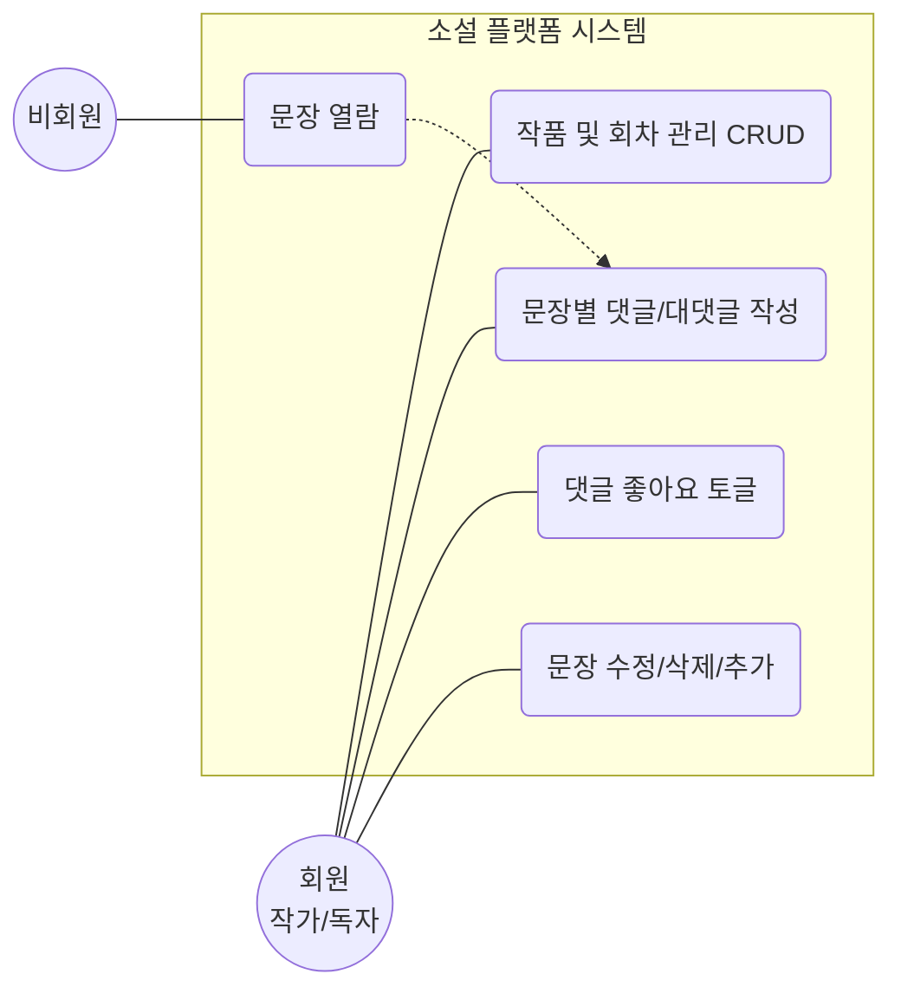

```mermaid
graph LR
    %% 액터 정의
    USER((회원 <br/> 작가/독자))
    GUEST((비회원))

    %% 시스템 경계 및 기능 정의
    subgraph AJOU_SE_PROJECT [소설 플랫폼 시스템]
        F1(작품 및 회차 관리 CRUD)
        F2(문장 열람)
        F3(문장별 댓글/대댓글 작성)
        F4(댓글 좋아요 토글)
        F5(문장 수정/삭제/추가)
    end

    %% 관계 연결
    USER --- F1
    USER --- F3
    USER --- F4
    USER --- F5
    
    GUEST --- F2
    
    %% 기능 간 관계
    F2 -.-> F3
```