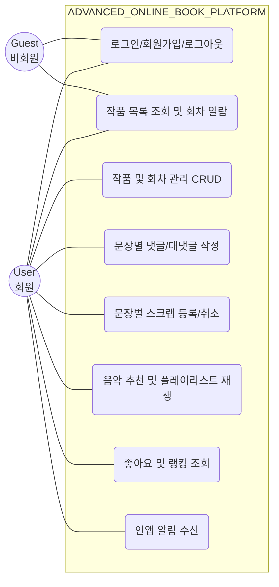

```mermaid
graph LR
    %% 액터 정의
    USER((User <br/> 회원))
    GUEST((Guest <br/> 비회원))

    subgraph "ADVANCED_ONLINE_BOOK_PLATFORM"
        %% 계정 및 기본 기능
        UC_AUTH(로그인/회원가입/로그아웃)
        UC_READ(작품 목록 조회 및 회차 열람)
        
        %% 콘텐츠 생성 (작가의 역할 포함)
        UC_WORK(작품 및 회차 관리 CRUD)
        
        %% 문장별 상호작용
        UC_INTERACT(문장별 댓글/대댓글 작성)
        UC_SCRAP(문장별 스크랩 등록/취소)
        
        %% 음악 및 부가 기능
        UC_MUSIC(음악 추천 및 플레이리스트 재생)
        UC_LIKE(좋아요 및 랭킹 조회)
        UC_ALARM(인앱 알림 수신)
    end

    %% 관계 연결
    USER --- UC_AUTH
    USER --- UC_WORK
    USER --- UC_INTERACT
    USER --- UC_SCRAP
    USER --- UC_MUSIC
    USER --- UC_LIKE
    USER --- UC_ALARM
    USER --- UC_READ

    GUEST --- UC_READ
    GUEST --- UC_AUTH
```